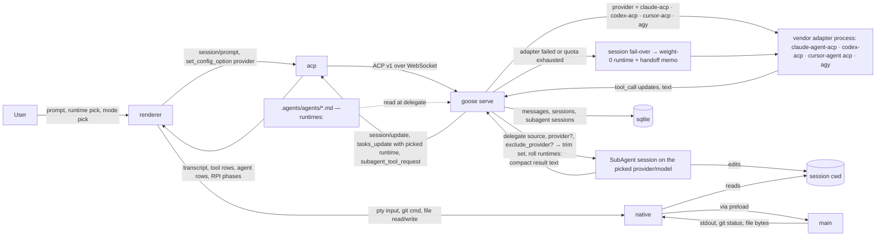

# Architecture

Read this before planning any change. If code contradicts this map, flag it.

## Bootstrap Status

Proposal, not a description of implemented code. melody-agent2 is a
planned fork of `aaif-goose/goose@a23a8cd5` (v1.50.0, 2026-09-14); the
tree read for this map is `~/github/goose`, and the boxes marked
**(new)** do not exist yet. Hand review promotes this map; sign-off
deletes this section. While it stands, the plan's drift flag is
suspended — an empty tree contradicts every map. Revised 2026-09-15
alongside `PRODUCT.md`: three spine touches (was two), ten role files
(was six), the runtime roll and fail-over in the data flow.

Flagged as accidental in upstream (do not copy into the fork's
conventions): `ui/desktop/src/*.ts` mixes main-process files
(`main.ts`, `gooseServe.ts`, `proxy.ts`) with renderer-shared helpers
(`sessions.ts`, `utils.ts`) at one level; the fork's new code goes under
directories, never at `src/` root.

## Module View

```mermaid
graph TD
    subgraph desktop["ui/desktop — Electron app (the fork)"]
        main[src/main.ts — main process: spawn goose serve, windows, PATH]
        mainnative[src/main/native — pty, fs watch, git handlers **(new)**]
        preload[src/preload.ts — bridge]
        renderer[src/renderer.tsx + App.tsx — routes → workspace shell]
        acp[src/acp — ACP client + _goose/* calls]
        components[src/components — chat, settings, sessions, tool calls]
        workspace[src/workspace — pane system, panes, header: Runtime · Mode, agents tree, RPI strip **(new)**]
        native[src/native — renderer clients for main/native **(new)**]
    end

    subgraph client["ui/goose-acp-client — generated ACP + _goose types"]
        gen[src/generated]
    end

    subgraph spine["crates — Goose spine"]
        cli[goose-cli — `goose serve` / `goose acp`]
        goose[goose — agent loop, acp server, summon, providers/*, sessions]
        agent[goose-agent — state-machine operations]
        providers[goose-providers — API-key providers]
        mcp[goose-mcp — bundled MCP servers]
    end

    subgraph project["melody-agent2 config"]
        roles[.agents/agents — ten role files, each with runtimes:]
    end

    renderer --> components
    renderer --> workspace
    workspace --> acp
    components --> acp
    workspace --> native
    native --> preload
    preload --> main
    main --> mainnative
    acp --> gen
    main -->|spawns| cli
    cli --> goose
    cli --> mcp
    goose --> agent
    goose --> providers
    goose -.->|reads cwd| roles
```

## Modules

- **main** — Electron main process: spawns `goose serve`, resolves the login-shell PATH, owns windows; no product logic.
- **main/native (new)** — the handlers Electron main must own for the panes: pty (node-pty), file watching, git commands; exposed only through preload.
- **preload** — the only bridge renderer ↔ main; typed, allowlisted.
- **renderer / App.tsx** — composition root; today page routes, in the fork a workspace shell that hosts routes as panes.
- **acp** — the one place the renderer talks ACP and `_goose/*`; every session, provider, extension, recipe call goes through here — including the session's `provider` config option that the Runtime selector and session fail-over set.
- **components** — upstream UI: chat, tool-call rendering, permissions, settings, sessions list; kept, not rewritten.
- **workspace (new)** — pane system (layout store, tab drag, side panel); the panes (files, editor, diff, terminal, git, browser, markdown); the header's Runtime and Mode selectors; the delegated-work tree and the RPI phase strip — the last two are views over ACP session notifications (`tasks_update`, `subagent_tool_request`) and delegate tool calls, and show the runtime the roll picked.
- **native (new)** — renderer-side clients for `main/native`; nothing here speaks ACP.
- **ui/goose-acp-client** — generated ACP + `_goose/*` types; regenerated from the crate, never edited by hand.
- **goose-cli / goose / goose-agent / goose-providers / goose-mcp** — the spine: sessions, modes, permissions, providers, `delegate`, star topology, handoff memo. The fork adds or edits three feature files inside `goose`, plus the provider registration points (`providers/mod.rs`, `providers/init.rs`, `inventory/registrations.rs`):
  - `src/agents/platform_extensions/summon.rs` — `runtimes:` weighted list in agent frontmatter, rolled once per `delegate` with excluded and unavailable runtimes dropped first, quota-exhausted picks re-rolled, and `exclude_provider` on `delegate` (`:208-214`, `:779-860`, `:1809-1838`).
  - `src/providers/cursor_acp.rs` (new) — `cursor-acp`, mirrors `claude_acp.rs`; the Grok runtime.
  - `src/providers/agy.rs` (new) — `agy`, cloned from `gemini_cli.rs`.
- **.agents/agents** — the ten role files (six roles, four Advisor specialists); read by `summon` from the session cwd; each carries `runtimes:`, so role → runtime is data here; the only per-project config.

## Invariants

- **workspace and native never import components' internals; they compose exported components** — contract: `dependency-cruiser` forbidden `src/{workspace,native} → src/components/**/internal`.
- **new code never imports `@agentclientprotocol/sdk` or `@aaif/goose-acp-client` except via `src/acp`** — contract: `dependency-cruiser` forbidden from `src/{workspace,native,main/native}` to those packages. Upstream already leaks this in `types/extensions.ts`, `recipe/*`, `settings/providers/ProviderGrid.tsx`, `ProviderCatalogPicker.tsx`; those are outside the rule's scope, listed here so the leak is known, not copied.
- **native never does ACP; acp never touches pty/fs/git** — contract: `dependency-cruiser` forbidden both directions.
- **the runtime selector is a view over the ACP `provider` config option** — no second provider registry in the renderer; contract: review rule, no mechanical check.
- **role → runtime lives only in the role file's `runtimes:`** — the renderer, the recipes and the orchestrator prompt never encode it; the orchestrator's own runtime never rolls (fail-over only); contract: review rule.
- **delegated work never nests** — a `SubAgent` session has no `delegate` tool and is refused if it calls it; contract: upstream `summon.rs:1369`, `:2163-2170`, not re-implemented.
- **`crates/goose/src/agents/agent.rs` and `state_machine/` are not edited in the fork** — contract: path deny in CI (`scripts/check-spine.sh`, to be written).

## Ownership

- **This file owns:** modules, dependency direction, invariants, folder map (via the diagram), data flow.
- **`PRODUCT.md` owns:** promise, users, principles, modes, runtimes and roles and the map between them, role contracts and artifacts, the RPI walk and delegation rules, budget strategy, workspace vision, scope tiers, success criteria.
- **`DESIGN.md` owns (from tranche 4):** frame, vocabulary, shared component states, token roles — the delta over Goose's design system; template `skills/rpi/templates/design.md`.
- **Feature PRDs (`docs/*-prd-*.md`) own:** one journey's observable behavior, its states and criteria.
- **The plan (`docs/*-plan-*.md`) owns:** approach, tranches, negative space.
- **`tasks.md` owns:** the open work; this file never lists tasks.
- **Upstream `~/github/goose/AGENTS.md` owns:** Goose's own build, test, and contribution rules; the fork inherits them for `crates/*`.

## Data Flow


