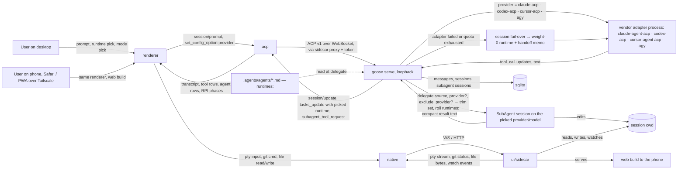

# Architecture

Read this before planning any change. If code contradicts this map, flag it.

## Bootstrap Status

**Promotion draft, 2026-09-20 (task 108).** Every box this map marks **(new)** exists in
the tree: `ui/sidecar/src` (pty, fs, git, runtimes, the ACP proxy, the web build),
`ui/desktop/src/shims/electron-web.ts` (a file, not the directory the diagram draws),
`ui/desktop/src/workspace` (the shell, the pane store, fourteen panes), `ui/desktop/src/native`,
the three spine files (`agents/platform_extensions/summon.rs`, `providers/cursor_acp.rs`,
`providers/agy.rs`) and the ten role files under `.agents/agents/`. Three claims below are
now wrong: the tree read for the map (`~/github/goose`) — the map has described this
repository since tranche 1; "do not exist yet"; and the suspended drift flag — with every box
built, a plan's drift check runs against a description. Everything under §Module View,
§Modules, §Invariants, §Ownership and §Data Flow has been amended in place, dated, as
tranches landed, and stays. Sign-off deletes this section.

Proposal, not a description of implemented code. melody-agent2 is a
planned fork of `aaif-goose/goose@a23a8cd5` (v1.50.0, 2026-09-14); the
tree read for this map is `~/github/goose`, and the boxes marked
**(new)** do not exist yet. Hand review promotes this map; sign-off
deletes this section. While it stands, the plan's drift flag is
suspended — an empty tree contradicts every map. Revised 2026-09-15
alongside `PRODUCT.md`: three spine touches (was two), ten role files
(was six), the runtime roll and fail-over in the data flow; later the
same day `main/native` became `ui/sidecar` so the phone's browser and
the Electron renderer share one path to pty, fs and git.

Flagged as accidental in upstream (do not copy into the fork's
conventions): `ui/desktop/src/*.ts` mixes main-process files
(`main.ts`, `gooseServe.ts`, `proxy.ts`) with renderer-shared helpers
(`sessions.ts`, `utils.ts`) at one level; the fork's new code goes under
directories, never at `src/` root.

## Module View

```mermaid
graph TD
    subgraph desktop["ui/desktop — Electron app (the fork)"]
        main[src/main.ts — main process: spawn goose serve + sidecar, windows, PATH]
        preload[src/preload.ts — bridge, shrinking to what only Electron can do]
        shim[src/shims/electron-web — window.electron for the browser build **(new)**]
        renderer[src/renderer.tsx + App.tsx — routes → workspace shell]
        acp[src/acp — ACP client + _goose/* calls]
        components[src/components — chat, settings, sessions, tool calls]
        workspace[src/workspace — pane system, panes, header: Runtime · Mode, agents tree, RPI strip **(new)**]
        native[src/native — renderer clients for the sidecar over WS **(new)**]
    end

    subgraph sidecar["ui/sidecar — Node service on the Mac **(new)**"]
        sc[src — pty, fs + watch, git, goose-serve proxy, static web build]
    end

    subgraph client["ui/goose-acp-client — generated ACP + _goose types"]
        gen[src/generated]
    end

    subgraph spine["crates — Goose spine"]
        cli[goose-cli — `goose serve` / `goose acp`]
        goose[goose — agent loop, acp server, summon, providers/*, sessions]
        agent[goose-agent — state-machine operations]
        providers[goose-providers — API-key providers]
        mcp[goose-mcp — bundled MCP servers]
    end

    subgraph project["melody-agent2 config"]
        roles[.agents/agents — ten role files, each with runtimes:]
    end

    renderer --> components
    renderer --> workspace
    workspace --> acp
    components --> acp
    workspace --> native
    native -->|WS / HTTP| sc
    renderer -.->|browser build| shim
    preload --> main
    acp --> gen
    main -->|spawns| cli
    main -->|spawns| sc
    sc -->|proxies /acp with token| cli
    cli --> goose
    cli --> mcp
    goose --> agent
    goose --> providers
    goose -.->|reads cwd| roles
```

## Modules

- **main** — Electron main process: spawns `goose serve` and the sidecar, resolves the login-shell PATH, owns windows; no product logic and no pane handlers.
- **ui/sidecar (new)** — the one process that touches the machine for the panes: pty (`node-pty`, sessions that outlive a client), fs read/write + `chokidar` watch, git commands, the `goose serve` WebSocket proxy that injects `?token=` (the secret never leaves the Mac), and the static web build. Reachable from the Electron renderer and from a browser on the tailnet alike; bound to the tailnet interface, never behind `tailscale funnel`. Amended 2026-09-16 (tasks 48, 54, 61): every `/git/*` body takes `cwd`, answered `400` unless its realpath is inside the spawn cwd's toplevel or a `.worktrees/` sibling of it — no route runs git elsewhere; worktrees exist only at `<toplevel>/.worktrees/<slug>` on `wt/<slug>` (`/git/worktree/{add,list,remove}`, `/git/merge` with `--no-ff`, `409` and the conflict list on a clash) and `.worktrees/` is invisible to the watcher; `/git/apply` is `git apply --recount` at the toplevel with the patch on stdin, all-or-nothing, the pane's only write to a hunk; `scheduler.rs` is the one other writer of `.worktrees/`, on the same slug shape, so Merge and Remove read a scheduled run's worktree like any other — a third writer is a bug; every machine route answers `401` without the per-launch key (§Invariants). Amended 2026-09-19 (tasks 73, 78, 80, 84, 94): `/fs/*` contained like `/git/*` — `requestPath(spawnCwd, body)` (`fs.ts`) resolves the realpath through the nearest existing ancestor and answers `400` unless it lies inside the spawn cwd's toplevel or a `.worktrees/` sibling; `/git/snapshot {cwd}` writes `add -A` into a temp index (`GIT_INDEX_FILE`) and returns the tree, the real index untouched, refused outside the toplevel; `/git/discard {cwd, path?}` stashes the working tree (or one path) and `/git/discard-undo` pops it, refused when the stash is not the one it made; `/runtimes/probe` runs four fixed argv arrays (`claude auth status --json`, `codex login status`, `cursor-agent status`, `agy models`) with a 5 s timeout each and never a shell, `ENOENT` or exit 127 reading as not installed.
- **preload** — the bridge renderer ↔ main for what only Electron can do (dialogs, dock, external open); typed, allowlisted, and shrinking — nothing a pane needs goes here.
- **shims/electron-web (new)** — the browser build's `window.electron`: the ~10 methods the reused components call (`getSetting`/`setSetting`, `on`/`off`, `logInfo`, `openExternal`, `getAcpUrl` → the sidecar), backed by the sidecar's HTTP; the spike that proves the components render outside Electron.
- **renderer / App.tsx** — composition root; today page routes, in the fork a workspace shell that hosts routes as panes.
- **acp** — the one place the renderer talks ACP and `_goose/*`; every session, provider, extension, recipe call goes through here — including the session's `provider` config option that the Runtime selector and session fail-over set.
- **components** — upstream UI: chat, tool-call rendering, permissions, settings, sessions list; kept, not rewritten.
- **workspace (new)** — pane system (layout store, tab drag, side panel); the panes (files, editor, diff, terminal, git, browser, markdown); the header's Runtime and Mode selectors; the delegated-work tree and the RPI phase strip — the last two are views over ACP session notifications (`tasks_update`, `subagent_tool_request`) and delegate tool calls, and show the runtime the roll picked. Amended 2026-09-16 (task 27's pick): `tasks_update` has no producer — the tree's source is the session bridge's per-session broadcast, forwarded by the ACP server as `DelegationUpdate` on `_goose/unstable/session/update`, keyed by `subagent_session_id` (`docs/2026-09-16-agent-activity-research-v1.md`).
- **native (new)** — renderer-side clients for the sidecar (pty stream, fs, git, watch events) over WS/HTTP; nothing here speaks ACP, and nothing here imports `electron` or Node.
- **ui/goose-acp-client** — generated ACP + `_goose/*` types; regenerated from the crate, never edited by hand.
- **goose-cli / goose / goose-agent / goose-providers / goose-mcp** — the spine: sessions, modes, permissions, providers, `delegate`, star topology, handoff memo. The fork adds or edits three feature files inside `goose`, plus the provider registration points (`providers/mod.rs`, `providers/init.rs`, `inventory/registrations.rs`):
  - `src/agents/platform_extensions/summon.rs` — `runtimes:` weighted list in agent frontmatter, rolled once per `delegate` with excluded and unavailable runtimes dropped first, quota-exhausted picks re-rolled, and `exclude_provider` on `delegate` (`:208-214`, `:779-860`, `:1809-1838`). Amended 2026-09-16 (task 47, parity plan decision 4): a delegated child's provider is built in the child's `working_dir` (`create_with_working_dir`), never the `goose serve` process cwd; containment is the session cwd's git toplevel, so `.worktrees/<slug>` is reachable from a session opened in a subdirectory and nothing outside the repo is.
  - `src/providers/cursor_acp.rs` (new) — `cursor-acp`, mirrors `claude_acp.rs`; the Grok runtime.
  - `src/providers/agy.rs` (new) — `agy`, cloned from `gemini_cli.rs`.
- **.agents/agents** — the ten role files (six roles, four Advisor specialists); read by `summon` from the session cwd; each carries `runtimes:`, so role → runtime is data here; the only per-project config.

## Invariants

- **workspace and native never import components' internals; they compose exported components** — contract: `dependency-cruiser` forbidden `src/{workspace,native} → src/components/**/internal`.
- **new code never imports `@agentclientprotocol/sdk` or `@aaif/goose-acp-client` except via `src/acp`** — contract: `dependency-cruiser` forbidden from `src/{workspace,native}` to those packages in `ui/desktop`, and a second config in `ui/sidecar` forbidding its `src/**` the same imports (task 18). Upstream already leaks this in `types/extensions.ts`, `recipe/*`, `settings/providers/ProviderGrid.tsx`, `ProviderCatalogPicker.tsx`; those are outside the rule's scope, listed here so the leak is known, not copied.
- **native never does ACP; acp never touches pty/fs/git** — contract: `dependency-cruiser` forbidden both directions.
- **the renderer runs in a browser** — `src/workspace`, `src/native` and `src/acp` never import `electron`, `node:*`, or `node-pty`; everything machine-side is a sidecar call — contract: `dependency-cruiser` forbidden from those dirs to `electron` and `node:*`, and the web build (`pnpm run build:web`) is a CI step.
- **the sidecar is the only remote shell; Tailscale is its fence and the per-launch key its lock** (amended 2026-09-16, task 61) — it binds the tailnet interface, holds the `goose serve` token, and is never exposed by `tailscale funnel`; the desktop mints a 32-byte key per launch (`SIDECAR_SECRET`, a second secret beside `GOOSE_SERVER__SECRET_KEY`, never the same one) and every `/fs/*`, `/git/*`, `/pty`, `/fs/watch` and `/acp` request answers `401` without it (`/health`, `/config` and the static web build stay open) — `X-Sidecar-Key` on a fetch, `?key=` on a WebSocket upgrade, compared in constant time; the phone's URL carries it once and the web shim keeps it in `localStorage`; contract: startup refusal when the bind address is public or `SIDECAR_SECRET` is unset, the check at the one dispatch point in `ui/sidecar/src/http.ts` and the upgrade entry in `index.ts`, `http.test.ts` 401 cases.
- **approve mode is measured, not assumed** (added 2026-09-19, tasks 77, 89) — `scripts/probe-approve.py` is the reference for what each seat does with Approve: it opens a session on one adapter, sets the mode Approve maps to, sends one prompt that needs a tool, answers the first `session/request_permission` with reject_once and prints every permission request verbatim — so whether a seat asks, and with what payload, is read from a run, not from its docs; the Session controls' note under the Mode radios (`approveModeNote`, `session-controls.ts`) restates its findings and is amended only from a rerun of the script; contract: review rule, the script's output pasted into the amending commit.
- **the runtime selector is a view over the ACP `provider` config option** — no second provider registry in the renderer; contract: review rule, no mechanical check.
- **role → runtime lives only in the role file's `runtimes:`** — the renderer, the recipes and the orchestrator prompt never encode it; the orchestrator's own runtime never rolls (fail-over only); contract: review rule.
- **delegated work never nests** — a `SubAgent` session has no `delegate` tool and is refused if it calls it; contract: upstream `summon.rs:1369`, `:2163-2170`, not re-implemented.
- **`crates/goose/src/agents/agent.rs` and `state_machine/` are not edited in the fork** — contract: path deny in CI (`scripts/check-spine.sh`, to be written).

## Ownership

- **This file owns:** modules, dependency direction, invariants, folder map (via the diagram), data flow.
- **`PRODUCT.md` owns:** promise, users, principles, modes, runtimes and roles and the map between them, role contracts and artifacts, the RPI walk and delegation rules, budget strategy, workspace vision, scope tiers, success criteria.
- **`DESIGN.md` owns (from tranche 4):** frame, vocabulary, shared component states, token roles — the delta over Goose's design system; template `skills/rpi/templates/design.md`.
- **Feature PRDs (`docs/*-prd-*.md`) own:** one journey's observable behavior, its states and criteria.
- **The plan (`docs/*-plan-*.md`) owns:** approach, tranches, negative space.
- **`tasks.md` owns:** the open work; this file never lists tasks.
- **Upstream `~/github/goose/AGENTS.md` owns:** Goose's own build, test, and contribution rules; the fork inherits them for `crates/*`.

## Data Flow


